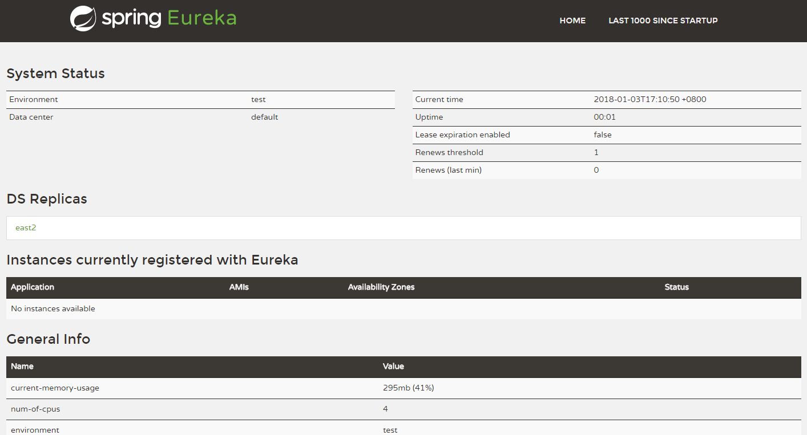

# 第一节 ： Spring Cloud Eureka #

### 1 基础搭建Eureka注册中心 ###

maven依赖：

    <dependency>
		<groupId>org.springframework.cloud</groupId>
		<artifactId>spring-cloud-starter-eureka-server</artifactId>
	</dependency>

### 2 注解使用

@EnableEurekaServer

### 3 配置文件
    server:
	  port: 8123
	
	spring:
	  application:
	    name: eureka-server
	eureka:
	  instance:
	    hostname: east1
	    perfer-ip-address: false
	  client:
	    registerWithEureka: false
	    fetchRegistry: false
	    serviceUrl:
	      defaultZone: http://east2:8124/eureka/

### 3 高可用的注册中心 ###

localhost:8123

localhost:8124

